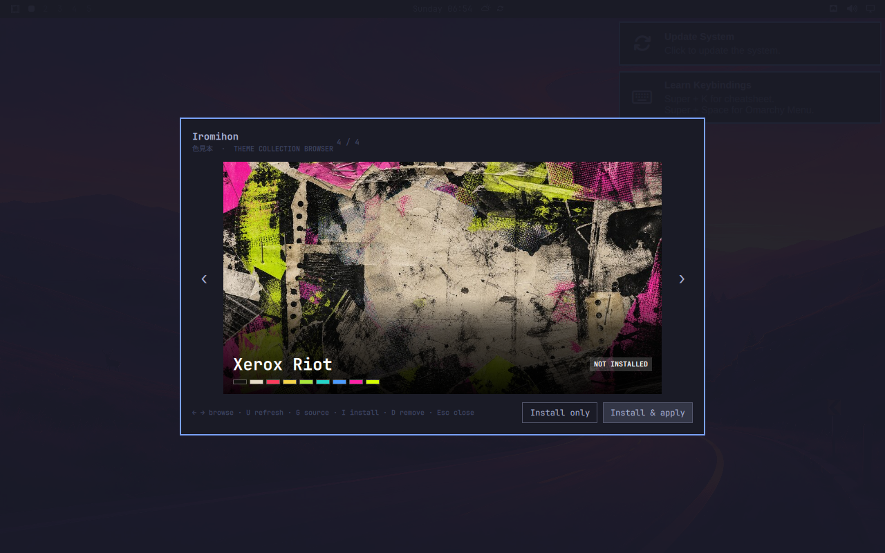

# Iromihon

**Iromihon** (色見本, *color sample*) is a theme collection browser for Omarchy Quattro.



Paste one public GitHub repository, flip through its native child themes, then install and apply exactly the one you want. Iromihon does not replace Omarchy's theme system. Selected children become ordinary entries under `~/.config/omarchy/themes/`, so the stock picker, backgrounds, hooks, templates, and `omarchy theme set` continue to work normally.

Iromihon owns the visual choice and includes its own bounded source engine for cloning, validation, selective installation, updates, and removal. Omarchy still owns activation: applying a child goes through the normal `omarchy theme set` path.

## Why it exists

Omarchy traditionally distributes one theme per Git repository. A collection author should be able to keep a coherent body of work together without forcing users to install every child or maintain a farm of tiny repositories.

Iromihon recognizes the native, manifest-free collection shape:

```text
omarchy-chaos-themes/
  themes/
    xerox-riot/
      colors.toml
      preview.png
      backgrounds/
    cable-rat-king/
      colors.toml
      preview.png
      backgrounds/
```

A direct child address appends its slug as a URL fragment:

```text
https://github.com/RegionallyFamous/omarchy-chaos-themes.git#xerox-riot
```

The fragment is a selection hint for Iromihon. Git sees only the canonical base URL, so every installed child reuses one clone.

## Install

Iromihon works on stock Omarchy Quattro and does not require a core patch.

```bash
omarchy plugin add https://github.com/RegionallyFamous/iromihon.git --enable
omarchy restart shell
```

Open **Iromihon** from Apps, or summon it directly:

```bash
omarchy-shell shell summon io.github.regionallyfamous.iromihon '{}'
```

## Controls

- `Left` / `Right` browse the current collection.
- `Enter` installs and applies the selected child.
- `I` installs the selected child without applying it.
- `D` removes the selected child from Omarchy while retaining the shared collection.
- `U` refreshes and revalidates the collection atomically.
- `G` opens another collection.
- `Escape` closes the overlay. Source operations are bounded and finish atomically rather than being abandoned halfway through.

## Deliberate boundaries

Iromihon is not a scheduler, folder organizer, palette editor, wallpaper generator, or hosted theme store. ThemeBook and other Omarchy tools already serve those workflows. Iromihon stays focused on the missing step before them: browsing one repository and selectively installing a native child.

The first release uses an honest image and palette preview. It does not claim to preview the entire running desktop; a true reversible shell preview needs a stable Omarchy preview API before it can be trusted.

## Security and data

- Only explicit public `https://github.com/owner/repository` inputs are accepted by the UI.
- Iromihon never receives Git credentials, runs repository files, requests privilege escalation, polls in the background, or contacts a hosted catalog.
- Its embedded engine rejects links, executable payloads, invalid slugs, oversized sources, palettes and previews, and collisions with themes it does not own.
- Validation is an integrity and native-contract check, not a malware guarantee. Themes can contain application configuration overrides; review repositories from authors you trust.
- Child installation and updates use one owner-only source registry and an installed-child allowlist. New upstream children never enter the stock picker automatically.

Iromihon stores shared clones under `${XDG_DATA_HOME:-~/.local/share}/omarchy/theme-sources/` and its installed-child records under `${XDG_STATE_HOME:-~/.local/state}/omarchy/theme-sources/`. These paths intentionally match the native interface proposed for Omarchy. If compatible `omarchy theme source` commands appear in a future release, Iromihon prefers them automatically; otherwise the embedded engine remains authoritative.

## Remove

```bash
omarchy plugin remove io.github.regionallyfamous.iromihon --yes
```

Removing the plugin does not remove installed themes or registered sources. The optional Apps launcher can be removed separately:

```bash
rm ~/.local/share/applications/io.github.regionallyfamous.iromihon.desktop
```

## License

MIT. Iromihon is an independent community plugin by RegionallyFamous and is not affiliated with Omarchy or 37signals.
