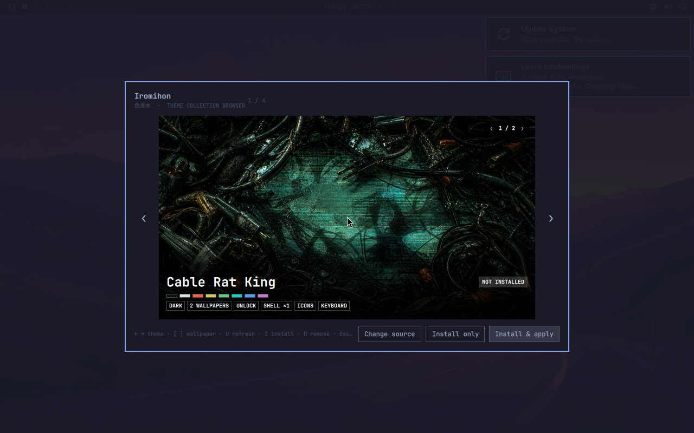

# Iromihon

**Iromihon** (色見本, *color sample*) is a theme collection browser for Omarchy Quattro.



Open Iromihon and its companion collection is ready to browse. Flip through native child themes and their actual wallpapers, see which ones ship unlock art, icon and keyboard hints, or authored shell surfaces, then install and apply exactly the one you want. Iromihon remembers that collection and the exact highlighted child across closing the overlay and restarting the shell. It only returns to source entry when you explicitly choose **Change source**, where you can paste any other compatible public GitHub repository.

Iromihon does not replace Omarchy's theme system. Selected children become ordinary entries under `~/.config/omarchy/themes/`, so the stock picker, backgrounds, hooks, templates, and `omarchy theme set` continue to work normally.

Iromihon owns the visual choice and includes its own bounded source engine for cloning, validation, selective installation, updates, and removal. Omarchy still owns activation: applying a child goes through the normal `omarchy theme set` path.

## Why it exists

Omarchy traditionally distributes one theme per Git repository. A collection author should be able to keep a coherent body of work together without forcing users to install every child or maintain a farm of tiny repositories.

Iromihon recognizes the native, manifest-free collection shape:

```text
iromihon-themes/
  themes/
    xerox-riot/
      colors.toml
      preview.png
      backgrounds/
    cable-rat-king/
      colors.toml
      preview.png
      backgrounds/
```

A direct child address appends its slug as a URL fragment:

```text
https://github.com/RegionallyFamous/iromihon-themes.git#xerox-riot
```

The fragment is a selection hint for Iromihon. Git sees only the canonical base URL, so every installed child reuses one clone.

## Install

Iromihon works on stock Omarchy Quattro and does not require a core patch.

```bash
omarchy plugin add https://github.com/RegionallyFamous/iromihon.git --enable
omarchy restart shell
```

Open **Iromihon** from Apps, or summon it directly:

```bash
omarchy-shell shell summon io.github.regionallyfamous.iromihon '{}'
```

On a fresh install, Iromihon opens the companion collection automatically:

```text
https://github.com/RegionallyFamous/iromihon-themes.git
```

No setup prompt or core patch is required. Choose **Change source** if you want to browse a different compatible collection; that choice remains in place across restarts.

## Controls

- `Left` / `Right` browse the current collection.
- `[` / `]` browse the selected theme's wallpapers.
- `Enter` installs and applies the selected child.
- `I` installs the selected child without applying it.
- `D` removes the selected child from Omarchy while retaining the shared collection.
- `U` refreshes and revalidates the collection atomically.
- **Change source** or `G` clears the current selection and opens another collection.
- `Escape` closes the overlay. Source operations are bounded and finish atomically rather than being abandoned halfway through.

The carousel is the child theme's real native `backgrounds/` directory, not a separate catalog preview:


## Deliberate boundaries

Iromihon is not a scheduler, folder organizer, palette editor, wallpaper generator, or hosted theme store. ThemeBook and other Omarchy tools already serve those workflows. Iromihon stays focused on the missing step before them: browsing one repository and selectively installing a native child.

The browser displays the child's real `backgrounds/` files and derives a fixed capability summary from ordinary native files. It does not execute metadata or claim to preview the entire running desktop; a true reversible shell preview still needs a stable Omarchy preview API before it can be trusted.

## Security and data

- The built-in `RegionallyFamous/iromihon-themes` collection is contacted on a true first launch. Every replacement source must be an explicit public `https://github.com/owner/repository` URL.
- Iromihon never receives Git credentials, runs repository files, requests privilege escalation, polls in the background, or contacts a hosted catalog.
- Its embedded engine rejects links, executable payloads, invalid slugs, oversized sources, palettes and previews, and collisions with themes it does not own. Wallpaper enumeration is capped at twelve per child, shell capability counts are capped at sixteen, and the QML model independently checks that every path remains inside that child's native directory.
- Validation is an integrity and native-contract check, not a malware guarantee. Themes can contain application configuration overrides; review repositories from authors you trust.
- Child installation and updates use one owner-only source registry and an installed-child allowlist. New upstream children never enter the stock picker automatically.

Iromihon stores shared clones under `${XDG_DATA_HOME:-~/.local/share}/omarchy/theme-sources/`, installed-child records under `${XDG_STATE_HOME:-~/.local/state}/omarchy/theme-sources/`, and the active collection plus child slug in `${XDG_STATE_HOME:-~/.local/state}/omarchy/iromihon/selection.json`. An explicit **Change source** choice is stored there as an empty preference so first-launch defaults cannot override it. Selection state is owner-only, bounded, and written atomically; it contains no credentials.

The source registry paths intentionally match the native interface proposed for Omarchy. If compatible `omarchy theme source` commands appear in a future release, Iromihon prefers them automatically; otherwise the embedded engine remains authoritative.

## Remove

```bash
omarchy plugin remove io.github.regionallyfamous.iromihon --yes
```

Removing the plugin does not remove installed themes or registered sources. The optional Apps launcher can be removed separately:

```bash
rm ~/.local/share/applications/io.github.regionallyfamous.iromihon.desktop
```

## License

MIT. Iromihon is an independent community plugin by RegionallyFamous and is not affiliated with Omarchy or 37signals.
